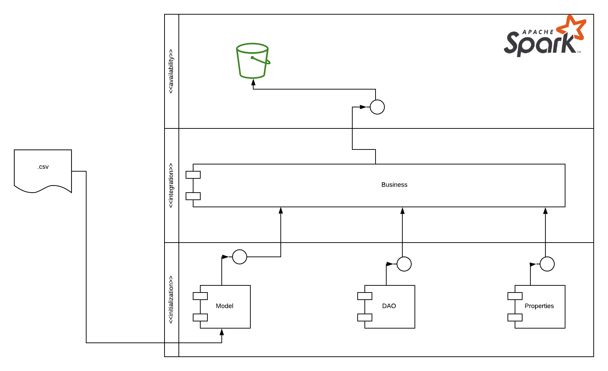

# Processamento de Dados.

## Table of contents
1. [Resumo](#resumo)
2. [Solução](#solucao)
    - [Normalização de dados utilizando Apache Spark](#normalizacao)
3. [Resultados](#resultados)

## Resumo 
O conteúdo deste repositório tem como objetivo demonstrar um fluxo de dados para realizar a escrita de dataframes em AWS Bucket S3
dados utilizando como base a tecnologia **Apache Spark**. Para esta poc foi viabilizado um arquivo csv
com informações geradas aleatóriamente.

## Solução 
Como destacado anteriormente, o case foi solucionado com base na tecnologia **Spache Spark** e outras tecnologias que 
viabilizaram esta POC:
1. [Apache Spark](https://spark.apache.org/)
2. [Python 3](https://www.python.org/)
3. [AWS Bucket](https://aws.amazon.com/s3/)

#### Normalizaçao de dados utilizando Apache Spark 
A organização do código Pyspark utilizada nesta POC seguiu o padrão semelhante a Arquitetura Orientada a Serviços (SOA) 
evidenciado abaixo. Este padrão contribui para fácil manutenção do código fonte e principalmente para escalabilidade de análises sob o dado coletado.

#### Model
Este componente tem a responsabilidade de fornecer as estruturas necessárias para a execução desta poc.

#### Business
Este componente tem como principal responsabilidade extrair os dados necessários para a execução das implementações dadas via regra de negócio.

#### DAO
Este componente tem como principal objetivo padronizar a utilização da Sessão Spark.

#### Property
Este componente tem como principal responsabilidade padronizar por meio de uma interface o acesso a diversos conjuntos 
de dados (inicialmente csv, tomado domo exemplo o arquivo **alunos.csv**)

## Resultados 
O case em destaque transforma o a classe `transformations.py` em um modelo de coleta, vizualização e disponibilização dos dados
em ambiente Cloud. Para a execução do modelo, foi dado x execuções e os dados para comparações estão armazenados 
no diretório `architecture/` desde repósitório, assim também como o csv para a viabilização dos dados.